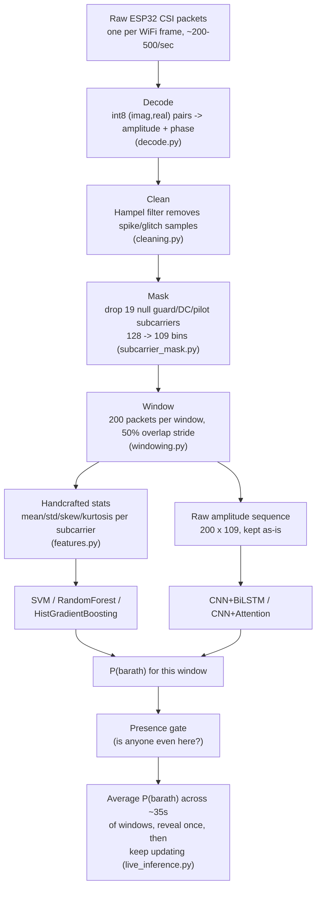
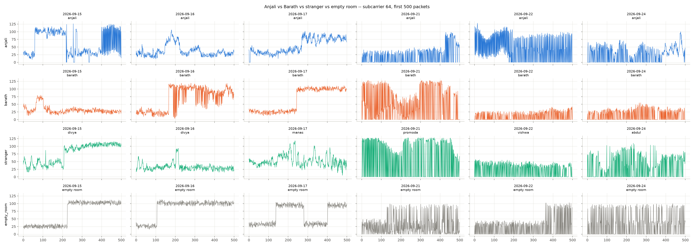
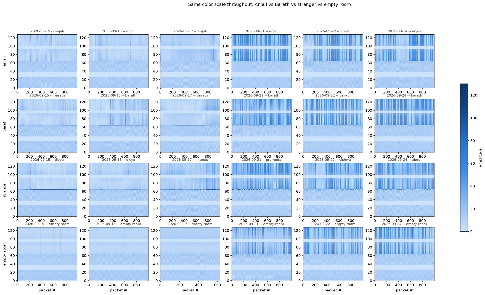
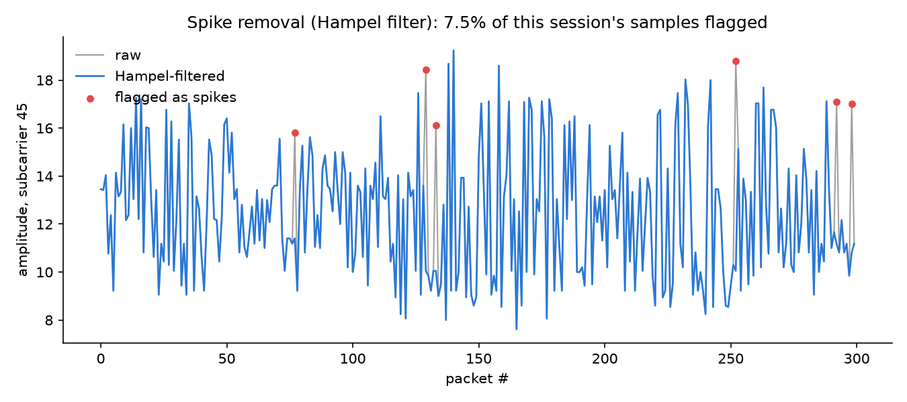
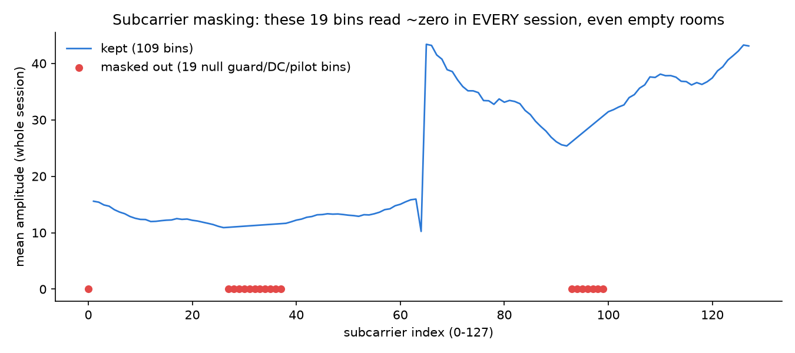
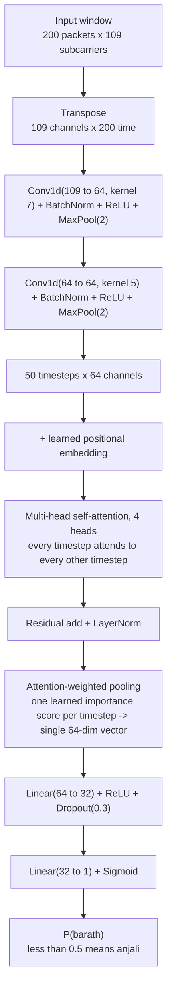
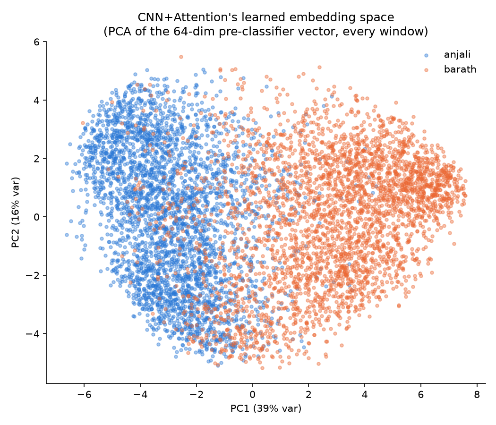
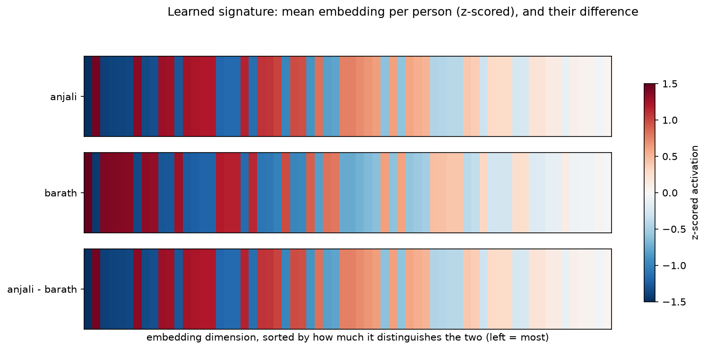
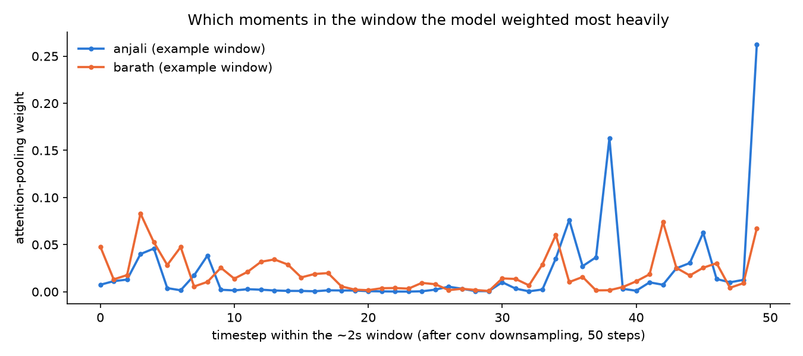

# End-to-end pipeline: raw CSI -> CNN+Attention -> "Anjali" or "Barath"

A visual/tabular walkthrough of everything between "someone is walking near the ESP32" and "the model
says who." For the numbers behind each claim here, see `FINDINGS.md`; for how this runs live, see
`DEPLOYMENT.md`.

## 1. The whole pipeline, top to bottom

**CNN+Attention is the recommended model** (strongest at nearly every checkpoint in `FINDINGS.md`'s
timing table) -- the rest of this doc focuses on that branch specifically.

## 2. What the raw signal actually looks like

Every CSI packet reports one complex number (amplitude + phase) per subcarrier -- 128 subcarriers
for this hardware's channel-6/20MHz config. Per-packet wire fields (see `collector/wire.py`,
`decode.py`):

| field | meaning |
|---|---|
| `device_time_us` | ESP32's own clock, microseconds -- the only reliable source of "how much real time has passed" |
| `rssi` | received signal strength, one scalar per packet |
| `channel_primary`, `cwb` | which WiFi channel/bandwidth this packet was captured on |
| `csi_len` | how many bytes of CSI data follow -- 256 bytes = 128 subcarriers for this dataset |
| `csi_data` | the actual CSI: 128 x (imag, real) signed-byte pairs -> `amplitude = hypot(real, imag)`, `phase = atan2(imag, real)` |

**Reading this by eye**: every trace looks like noisy, bursty motion -- there's no obvious visual
difference between Anjali, Barath, a stranger, or even (in some ranges) an empty room, at this raw
level. That's expected, and it's exactly why the pipeline below exists -- the person signal here is
real (see `FINDINGS.md`) but *subtle*, not something you can eyeball.

## 3. Heatmaps: subcarrier x time, across all 6 collection days

Same color scale throughout. Two things stand out immediately:

1. **A vertical-stripe pattern in subcarriers ~64-96 shows up identically in EVERY panel, including
   empty rooms.** That rules it out as a person signature by construction -- it's a receiver/antenna
   hardware artifact, not a body effect. (This is exactly the band `subcarrier_mask.py` and the null
   bins visible in section 4 below come from -- see the ~27-37 and ~93-99 dead zones flanking it.)
2. **Presence vs. empty room is visually obvious** (the empty-room row looks calmer/more uniform than
   the occupied rows) **but Anjali vs. Barath vs. a stranger is not** -- all three occupied rows look
   like "the same kind of noisy" to the eye. This matches the quantitative finding in `FINDINGS.md`:
   presence is an easy, high-SNR problem (77-96% cross-day); identity is a real but much subtler one
   that needs a trained model, not a glance, to extract.

## 4. Cleaning & preprocessing

| step | what happens | why | code |
|---|---|---|---|
| **Decode** | int8 (imag, real) byte pairs -> amplitude + phase per subcarrier per packet | turns the wire format into numbers to work with | `decode.py::decode_dominant_bucket` |
| **Spike removal** | Hampel filter: per-subcarrier rolling median + MAD; samples deviating >4 robust-sigma get replaced with the local median | real sensor glitches/corrupted samples exist (~5-9.5% of samples per session, measured) and would otherwise pollute every downstream feature | `cleaning.py::hampel_filter_amplitude` |
| **Subcarrier masking** | drop 19 of 128 subcarrier bins (indices `[0, 27-37, 93-99]`) | these read ~zero amplitude in EVERY session tested, including empty rooms -- confirmed hardware guard/DC/pilot bins, zero identity information by construction, pure dead weight in every feature vector | `subcarrier_mask.py` |

After this, every window is `200 packets x 109 subcarriers` (down from the raw 128) -- both figures
above are from a real Anjali session.

## 5. Windowing

| parameter | value | meaning |
|---|---|---|
| window length | 200 packets | roughly 0.5-1s of real time (varies with capture rate, 200-500 Hz observed -- NOT a fixed "1 packet = 1ms" assumption, see `FINDINGS.md`) |
| stride | 100 packets | 50% overlap between consecutive windows |

Each window becomes one training/inference example: either a handcrafted 874-dim stats vector (for
SVM/RF/HGB) or the raw `200 x 109` amplitude array (for the CNN models).

## 6. Model architecture: CNN+Attention

| layer | shape in -> out | job |
|---|---|---|
| Conv1d x2 (+ BatchNorm, ReLU, MaxPool) | `(109, 200)` -> `(64, 50)` | extract short local temporal patterns PER subcarrier -- e.g. how amplitude on one frequency bin rises/falls over a few tens of packets, roughly one small slice of a gait cycle |
| learned positional embedding | `(50, 64)` | attention alone has no sense of time order -- this adds it back |
| self-attention (4 heads) | `(50, 64)` -> `(50, 64)` | lets every moment in the ~1s window directly relate to every other moment, instead of only nearby ones (what the conv layers alone would see) -- e.g. matching up two points in a stride cycle that look similar |
| attention pooling | `(50, 64)` -> `(64,)` | collapses the whole window into ONE vector, weighted by how informative the model has learned each moment is -- not a plain average |
| MLP head | `(64,)` -> `(1,)` | maps that single "gait fingerprint" vector to a probability |

**Implementation**: `models.py::CnnAttention`. `torch_model_predict_proba` runs it; `train_final.py`
trains the deployed checkpoint (`checkpoints/cnn_attention_final.pt`).

## How the model actually learns a "person's signature"

`FINDINGS.md` and the standing-vs-walking comparison established the key fact this architecture is
built around: **identity information in this data lives in movement dynamics, not a static "shape"
signature** -- a standing person's CSI barely carries any day-stable identity signal, while a walking
person's does. Every piece of this architecture follows from that:

1. The **conv layers** don't look at one packet at a time -- they look at short temporal patterns per
   subcarrier, because a single instant tells you nothing about gait; the shape of the fluctuation
   over ~10-40 packets might.
2. **Self-attention** lets the model relate different points across the whole ~1s window to each
   other -- useful because a gait cycle (footstep, swing, footstep) has repeating structure across
   the WHOLE window, not just between adjacent moments a convolution's small kernel can see.
3. **Attention pooling** (rather than just averaging or taking the last timestep) lets the model
   decide *which parts of this particular window* were most identity-informative -- e.g. weighting
   the mid-stride moments more than a brief pause, if that's what training found useful.
4. The result is a single per-window embedding that -- averaged across many windows via the
   session-level/live-reveal logic in `live_inference.py` -- becomes stable enough to tell Anjali and
   Barath apart with real, cross-day-confirmed accuracy (`FINDINGS.md`: 3.6-4.6 std above a
   permutation chance floor at the window level, 82-90% at the session/live-reveal level).

## What the learned signature actually looks like (`visualize_learned_signature.py`)

This is the most direct visual evidence in this whole repo: colored by person, the model's learned
64-dim embedding (PCA'd down to 2D) shows **clean visual separation along PC1 alone** -- Anjali
mostly left, Barath mostly right. Compare this to `FINDINGS.md`'s raw-feature PCA/UMAP plots, which
show **no** visible clustering at all on the same two people. That contrast is the whole point of
training a model instead of eyeballing a scatterplot: the raw data doesn't visibly separate them, but
a representation trained specifically to tell them apart does.

Each person's average embedding vector, side by side, plus the difference row -- literally "what the
model thinks Anjali typically looks like" vs Barath, dimension by dimension.

Which moments in the window the self-attention pooling step (section 6, step 3) weighted most heavily
for one example window each -- Anjali's example spikes sharply near the end of the window; Barath's
spreads across several moderate peaks earlier on. This is from a single representative window per
person, illustrating that the model genuinely weights different moments differently (not just
averaging blindly) -- not a claim that either person has one fixed, always-the-same attention pattern.

## 7. End-to-end shape summary

| stage | input | output | file |
|---|---|---|---|
| Decode | raw packet bytes | amplitude/phase per packet, 128 subcarriers | `decode.py` |
| Clean | `(n_packets, 128)` | same shape, spikes replaced | `cleaning.py` |
| Mask | `(n_packets, 128)` | `(n_packets, 109)` | `subcarrier_mask.py` |
| Window | `(n_packets, 109)` | one `(200, 109)` window per stride step | `windowing.py` |
| CNN+Attention | `(200, 109)` | one scalar, `P(barath)` | `models.py` |
| Live reveal | many `P(barath)` over ~35s | one label + confidence, then continuously updated | `live_inference.py` |
